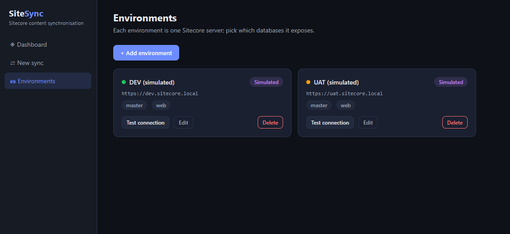
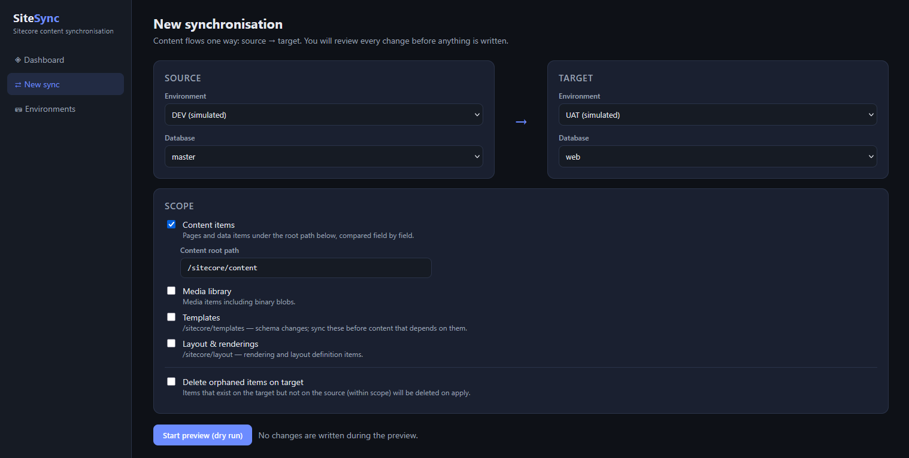
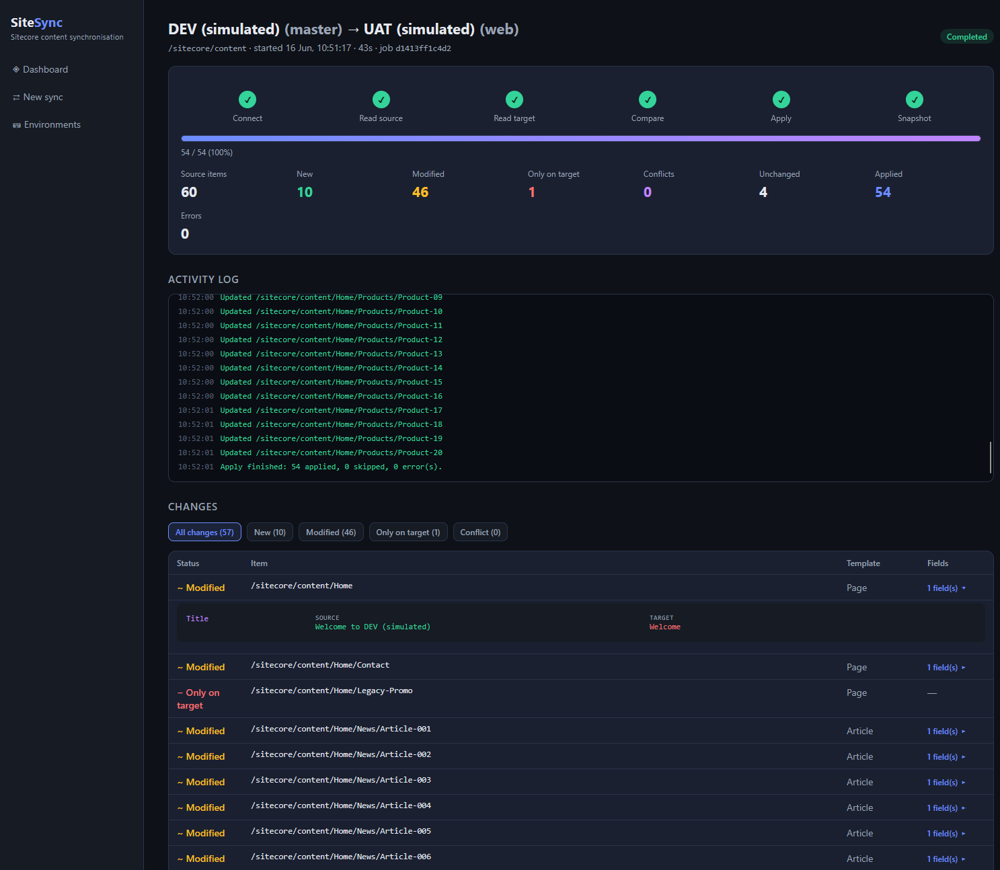

# SiteSync — Sitecore content synchronisation

A standalone module that synchronises content between **Sitecore XM/XP 10.x environments on different servers**, with a visual dashboard showing live progress, field-level diffs and conflict resolution. Nothing is installed inside Sitecore — it talks to each environment over the standard **Item Service REST API** (`/sitecore/api/ssc`).

Any environment+database pair can be source or target: `master → web` on one server, `master → master` across servers, etc. Content always flows one way (source → target) and every change is previewed before anything is written.


*The dashboard: registered environments, live counters, and the full history of previews and applies.*

## Architecture

```
client/                  React + TypeScript dashboard (Vite)
src/SiteSync.Server/     ASP.NET Core 8 — sync engine, REST API, SignalR live progress
tests/                   xUnit tests for the diff/conflict engine
```

- **Connectors** (`Connectors/`) — `ISitecoreConnector` abstracts one environment.
  - `ItemServiceConnector`: real Sitecore via Item Service (cookie auth, CRUD, media handler download, media blob upload).
  - `SimulatedConnector`: in-memory Sitecore stand-in with seeded differences, so the whole app runs and demos without any Sitecore server. Two simulated environments are seeded on first run.
- **Sync engine** (`Sync/`) — preview discovers both trees in parallel (items matched by GUID), `DiffCalculator` produces field-level diffs (system fields like `__Revision`/`__Updated by` excluded), apply pushes creates (parents first), updates, media blobs and orphan deletions (children first).
- **Conflict detection** — after each apply, a revision snapshot per (source, target) pair is stored under `data/snapshots`. On the next sync, an item changed on *both* sides since that snapshot is flagged as a conflict and is never applied without an explicit resolution (*use source* / *skip*). On a first sync (no snapshot) a heuristic flags items whose target copy is newer than the source copy.
- **Progress** — the engine streams phase/percentage/log events over SignalR (`/hubs/sync`); the dashboard updates live.
- **Persistence** — JSON files under `src/SiteSync.Server/data/` (environments, job history, snapshots). No database needed.

## Run it

```powershell
# 1. build the dashboard into the server's wwwroot
cd client
npm install
npm run build

# 2. run the server (serves API + dashboard)
cd ..
dotnet run --project src/SiteSync.Server
# open http://localhost:5210
```

First run seeds two **simulated** environments (DEV/UAT) so you can try a full sync immediately: *New sync → DEV (master) → UAT (web) → Start preview*, review the diff, resolve the conflict, *Apply*.

For development with hot reload: run the server, then `npm run dev` in `client/` (Vite proxies `/api` and `/hubs` to port 5210).

```powershell
dotnet test            # diff/conflict engine + end-to-end engine tests
```

## How a sync works

The screenshots below use the two seeded simulated environments, but the flow is identical against real Sitecore instances.

### 1. Register your environments

Each card is one Sitecore server and the databases it exposes. **Test connection** performs a real login and reads the `/sitecore` root, so you know the credentials and network path work before running a sync.



### 2. Configure the sync

Pick any source and target environment+database pair, then choose what to compare — content under a root path, media library, templates, and layout — plus whether orphaned target items should be deleted on apply.



### 3. Watch progress, review the diff, then apply

The job page streams live over SignalR: phase stepper, progress bar, counters, and the activity log. When the preview finishes you get the change list — expand any row to compare source and target field values side by side, resolve conflicts, and only then apply.



## Connecting real Sitecore 10.x environments

Add an environment in the dashboard with connector **Sitecore Item Service** and the CM host URL, plus credentials of a user with read/write access to the relevant databases. Prerequisites on each Sitecore instance:

1. **Item Service enabled** — it is by default; verify `https://<cm-host>/sitecore/api/ssc/item/?path=/sitecore` returns JSON after login.
2. The SiteSync host must be able to reach each CM server over HTTPS (different servers/networks are fine — this is plain REST).
3. The login user needs `sitecore\Sitecore Client Users` membership plus item read/write on the synced paths; database write access to `web` requires the user to be allowed on that database.
4. For media blob upload the Sitecore Media API (`/sitecore/api/ssc/item/{id}/media`) must be reachable; media item *fields* sync regardless.

### Notes & limitations (v1)

- Items are matched by **GUID**, so environments must share ancestry (standard for master↔web or content-synced environments). Renames and moves propagate as field/path updates.
- One language/version per item (the Item Service default context). Multi-language sync is the natural next step.
- Deletions on the target are only performed when *“Delete orphaned items on target”* is checked, and conflicts are never overwritten silently.
- Credentials are stored in `data/environments.json` on the SiteSync host — keep that directory protected (or wire in a secrets store).
